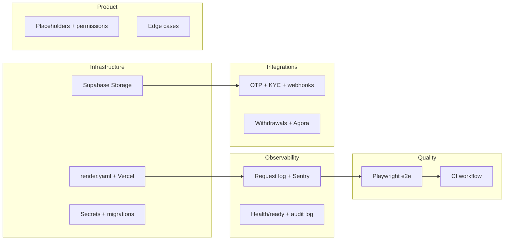

# Production-grade features and security plan

## Current state (from codebase)

- **API**: Express app with health at `/health` (OK + optional DB ping), request-id middleware, JSON logger (no request-scoped logging), error handler with requestId. No readiness/liveness split. Worker exists (`[apps/api/src/worker.ts](apps/api/src/worker.ts)`) for reservation lifecycle.
- **Deployment**: No `render.yaml`, Dockerfile, or GitHub Actions. Ship script does typecheck, lint, build, commit, and `supabase db push`; no automated deploy.
- **Secrets**: Env via `[apps/api/.env.example](apps/api/.env.example)` and `[apps/api/src/config/env.ts](apps/api/src/config/env.ts)`. No secret management or rotation story.
- **Storage**: Uploads served from local `uploads/` (`[apps/api/src/app.ts](apps/api/src/app.ts)`); no Supabase Storage (or S3) integration yet.
- **OTP/Email**: Implemented in `[apps/api/src/utils/send-transactional-email.ts](apps/api/src/utils/send-transactional-email.ts)` (console / Brevo / SendGrid). Default is `console`; production needs Brevo or SendGrid configured and verified.
- **KYC**: Provider abstraction in `[apps/api/src/modules/verification/verification.provider.ts](apps/api/src/modules/verification/verification.provider.ts)` (Didit, Idenfy, manual). Didit has createSession + webhook; manual is admin-review only.
- **Payments**: NOWPayments IPN routes mounted with raw body (`[apps/api/src/app.ts](apps/api/src/app.ts)`); Stripe webhook documented in `[apps/api/docs/STRIPE.md](apps/api/docs/STRIPE.md)` but **not** mounted (no `/api/wallet/stripe-webhook` with raw body). Cryptomus webhook not present in app.ts. Withdrawals exist (wallet controller + routes).
- **Agora**: Token builder in `[apps/api/src/lib/agora-token.ts](apps/api/src/lib/agora-token.ts)`; env `AGORA_APP_ID` / `AGORA_APP_CERTIFICATE`. No production-specific flow (e.g. token expiry, channel naming, abuse limits) documented.
- **Audit**: `admin_reviews` table for verification decisions; no general admin-action or audit log.
- **Tests**: Vitest for API; no Playwright or e2e; no CI (no `.github/` workflows).

---

## 1. Production infrastructure

**Goal:** Define and document deployment for web + API + worker + Postgres + storage + domain + SSL + env secrets + automated migrations.

| Component        | Target                     | Actions                                                                                                                                                                                                                                                                                                                                                                      |
| ---------------- | -------------------------- | ---------------------------------------------------------------------------------------------------------------------------------------------------------------------------------------------------------------------------------------------------------------------------------------------------------------------------------------------------------------------------- |
| **Web**          | Vercel                     | Add `vercel.json` if needed (rewrites to API already in `[apps/web/next.config.ts](apps/web/next.config.ts)`). Document env vars (e.g. `NEXT_PUBLIC_API_URL`). Ensure build command and output dir match monorepo (e.g. `apps/web` as root).                                                                                                                                 |
| **API**          | Render Web Service         | Add `[render.yaml](https://render.com/docs/blueprint-spec)` (or equivalent) for API: build (e.g. `npm run build -w @mohandishub/api`), start (`node dist/server.js`), health path `/health`, env from Render env / secret files.                                                                                                                                             |
| **Worker**       | Render Background Worker   | Same repo; separate service in blueprint: start `node dist/worker.js` (or `npm run worker -w @mohandishub/api`), same env as API, no health needed (or simple HTTP ping).                                                                                                                                                                                                    |
| **Postgres**     | Supabase                   | Already in use. Document production DB URL (pooler vs direct), connection limits, and that migrations run via ship or CI (see below).                                                                                                                                                                                                                                        |
| **Storage**      | Supabase Storage           | Implement storage layer: create bucket(s) (e.g. `verification-docs`, `uploads`), RLS/policies, API routes to generate signed upload URLs or use service role for server-side upload. Migrate existing upload logic (e.g. in `[apps/api/src/modules/upload](apps/api/src/modules/upload)` if any, and verification image URLs) from local disk to Supabase Storage.           |
| **Domain + SSL** | Vercel + Render            | Document: custom domain for web on Vercel (SSL automatic); custom domain for API on Render (e.g. `api.mohandishub.app`) with SSL. CORS and `API_PUBLIC_URL` / `WEB_PUBLIC_URL` / `CORS_ORIGIN` set accordingly.                                                                                                                                                              |
| **Env secrets**  | Vercel + Render + Supabase | Document required env per service (see `[.env.example](apps/api/.env.example)`). Use Render “Secret Files” or env for API/worker secrets; Vercel env for web; Supabase env for storage keys if needed. No secrets in repo.                                                                                                                                                   |
| **Migrations**   | Staging vs production      | **Staging:** Run migrations in CI against staging DB (e.g. on push/PR or on merge to `main`); use staging `DATABASE_URL` secret. **Production:** Gated ship/manual step only — do not auto-run migrations against production in CI; use `npm run ship` or a documented manual process to run `supabase db push` against production when releasing. Document both in runbook. |

**Deliverables:** `render.yaml` (or Render dashboard equivalent), `vercel.json` / docs for Vercel, storage migration (Supabase Storage + code changes), and a short **deployment runbook** (env checklist, migration process, rollback).

---

## 2. Reliability and observability

**Goal:** Structured request logging, error tracking, health/readiness, uptime monitoring, audit logs, admin action logs, backup/restore.

| Item                           | Current                                      | Action                                                                                                                                                                                                                                                        |
| ------------------------------ | -------------------------------------------- | ------------------------------------------------------------------------------------------------------------------------------------------------------------------------------------------------------------------------------------------------------------- |
| **Structured request logging** | Request-id only; no per-request log          | Add middleware that logs after response: method, path, statusCode, requestId, durationMs, (optional) userId. Keep JSON shape; ensure no PII in logs.                                                                                                          |
| **Error tracking**             | Logger.error to stdout                       | Integrate a provider (e.g. Sentry): init in API and web, report unhandled errors and 5xx, attach requestId/userId where available. Use env to disable in dev.                                                                                                 |
| **Health / readiness**         | Single `/health` with DB ping                | Add `/ready` (or extend `/health`) that returns 503 if DB (or critical deps) unavailable; use for Render “health check path”. Optionally `/live` (no DB) for liveness. Document which URL Render uses.                                                        |
| **Uptime monitoring**          | None                                         | Document: use an external service (e.g. UptimeRobot, Better Stack) to hit `/health` (and optionally web root) at an interval; alert on failure.                                                                                                               |
| **Audit logs**                 | None (only `admin_reviews` for verification) | Add an `audit_log` table (e.g. `actor_id`, `action`, `resource_type`, `resource_id`, `details` JSONB, `ip`, `created_at`) and a small service to append. Use for sensitive actions (e.g. admin user role change, wallet adjust, verification approve/reject). |
| **Admin action logs**          | None                                         | Same as audit: log admin-only actions (settings change, user deactivate, plan change, etc.) with actor and details. Can be same table with `action` namespace.                                                                                                |
| **Backup/restore**             | Supabase managed                             | Document Supabase backup schedule and point-in-time recovery; add a short runbook for “restore from backup” and who can do it.                                                                                                                                |

**Deliverables:** Request-logging middleware, Sentry (or equivalent) in API and web, `/ready` (and docs), audit_log table + write path for critical/admin actions, runbook for backup/restore and monitoring.

---

## 3. Critical integrations

**Goal:** Finish OTP/email, KYC provider, payment webhooks, withdrawals, and Agora production flow.

| Integration           | Current                        | Action                                                                                                                                                                                                                                                                                                                                                                                                                                                                                                 |
| --------------------- | ------------------------------ | ------------------------------------------------------------------------------------------------------------------------------------------------------------------------------------------------------------------------------------------------------------------------------------------------------------------------------------------------------------------------------------------------------------------------------------------------------------------------------------------------------ |
| **OTP / Email**       | Implemented; default `console` | For production: set `OTP_EMAIL_PROVIDER=brevo` (or sendgrid), configure `BREVO_API_KEY`, `EMAIL_FROM` (verified sender). Test password reset and verify-email flows. Optionally add SendGrid and document when to use which.                                                                                                                                                                                                                                                                           |
| **KYC provider**      | Didit + manual                 | **Launch with both:** Didit (primary) and optional manual (admin review). Ensure env for Didit (`DIDIT_API_KEY`, `DIDIT_WEBHOOK_SECRET`, `DIDIT_WORKFLOW_ID`) and webhook URL; test createSession → redirect → webhook → status update. Keep manual path for edge cases. **Product copy:** Show users a note that verification typically takes **1–5 business days**.                                                                                                                                  |
| **Payments (launch)** | NOWPayments only               | **NOWPayments is the current path for launch.** Ensure deposits + IPN (already mounted) are production-ready: correct webhook URL, `NOWPAYMENTS_IPN_SECRET`, idempotency and error handling. **Withdrawals** are via NOWPayments as well: `NOWPAYMENTS_WITHDRAWALS_ENABLED`, auth for payout APIs, IPN for payout status; document min amount, currency, and manual verification if used. **Later:** Stripe, Cryptomus, Paymob, etc. can be integrated as additional options; not required for launch. |
| **Agora production**  | Token built; no doc            | Document: set `AGORA_APP_ID` and `AGORA_APP_CERTIFICATE` in production; channel naming (e.g. include reservationId), token expiry (e.g. 1h), and any rate limits. Optionally add server-side checks (user in reservation before issuing token).                                                                                                                                                                                                                                                        |

**Deliverables:** Env and runbook for OTP/email; Didit + manual KYC documented with 1–5 business days note in UI; NOWPayments deposits + withdrawals production checklist and runbook; Agora production runbook.

---

## 4. Product completion

**Goal:** Finish or remove placeholder pages from launch scope; tighten permissions and edge cases in business/orders/projects/browse.

| Area                  | Current                                                                                                                                                             | Action                                                                                                                                                                                                    |
| --------------------- | ------------------------------------------------------------------------------------------------------------------------------------------------------------------- | --------------------------------------------------------------------------------------------------------------------------------------------------------------------------------------------------------- |
| **Placeholder pages** | Business dashboard “Orders” and “Analytics” show “Coming soon” (`[apps/web/components/app/business-dashboard.tsx](apps/web/components/app/business-dashboard.tsx)`) | Decide: either (a) remove from nav for launch and keep routes as 404 or redirect, or (b) implement minimal Orders (list) and/or Analytics (stub). Document launch scope.                                  |
| **Permissions**       | Admin routes use `requireAdmin`; some flows may allow cross-role access                                                                                             | Audit: ensure admin-only endpoints are behind admin check; ensure business cannot access expert-only actions and vice versa; ensure “list my X” is always scoped by current user. Fix any missing checks. |
| **Edge cases**        | Reservation, bookings, jobs, browse                                                                                                                                 | Review: cancel-after-complete, double-submit, expired sessions, negative amounts, missing wallet balance before booking. Add validation and idempotency where needed (e.g. wallet debit, withdrawal).     |
| **Browse / projects** | Exists                                                                                                                                                              | Confirm filters and visibility rules (e.g. only active services, only verified experts if applicable); fix any hardcoded or overly broad queries.                                                         |

**Deliverables:** Launch-scope list (what’s in/out); permission audit and fixes; list of edge-case fixes and validations.

---

## 5. Quality gate

**Goal:** Add Playwright (or equivalent) e2e for highest-risk journeys and require it in CI before deploy.

| Item          | Action                                                                                                                                                                                                                                                                                                                                                                                                                                                                                                                                                                                                                                                                                                                                                                                                                             |
| ------------- | ---------------------------------------------------------------------------------------------------------------------------------------------------------------------------------------------------------------------------------------------------------------------------------------------------------------------------------------------------------------------------------------------------------------------------------------------------------------------------------------------------------------------------------------------------------------------------------------------------------------------------------------------------------------------------------------------------------------------------------------------------------------------------------------------------------------------------------- |
| **E2E stack** | Add Playwright in repo (e.g. `apps/e2e` or root): install Playwright, config (baseURL from env). Implement **5 must-pass journeys** on every deploy: (1) **Auth + onboarding** — register → verify email (or stub) → login → complete role onboarding; (2) **Customer need to expert engagement** — login as customer → create need → (as expert) view/place bid or equivalent engagement; (3) **Reservation / booking lifecycle** — create or accept reservation → move through key states (e.g. accepted, in_session or completed); (4) **Admin verification flow** — login as admin → open verification list → approve or reject an item; (5) **Wallet/payment flow** — login → open wallet → initiate deposit or withdrawal (or reach payment step) and assert expected UI/state. Use test/staging API and DB so CI is stable. |
| **CI**        | Add GitHub Actions (e.g. `.github/workflows/ci.yml`): on push/PR run typecheck, lint, unit tests, then e2e against **staging**. Run migrations against staging in CI (e.g. before e2e). Gate: require CI green before merge (branch protection).                                                                                                                                                                                                                                                                                                                                                                                                                                                                                                                                                                                   |
| **Deploy**    | **Production** is gated: ship/manual step only. Do not auto-deploy or auto-migrate production from CI. Document: run CI (including all 5 e2e journeys) before production release; then use `npm run ship` or manual process to run migrations against production and deploy. “”                                                                                                                                                                                                                                                                                                                                                                                                                                                                                                                                                    |

**Deliverables:** Playwright setup and all 5 must-pass e2e journeys; `.github/workflows/ci.yml` running typecheck, lint, unit, migrations (staging), e2e (staging); runbook for production ship/manual step.“”

---

## 6. Phasing and dependencies

Suggested order:

1. **Phase 1 (infra + observability):** Render + Vercel + Supabase Storage migration; request logging; Sentry; health/ready; audit_log and admin logging; backup/restore runbook. Migrations: CI runs against staging; production via ship/manual only.
2. **Phase 2 (integrations):** OTP/email production config; KYC = Didit + optional manual with “1–5 business days” note; NOWPayments deposits + withdrawals production-ready; Agora production doc. (Stripe / Cryptomus / Paymob later.)
3. **Phase 3 (product + quality):** Launch-scope and placeholders; permission and edge-case audit; Playwright e2e — all 5 must-pass journeys; CI workflow with staging migrations + e2e; production gated ship/manual.

---

## 7. Decisions (locked in)

- **Payments for launch:** NOWPayments only (deposits + withdrawals). Stripe, Cryptomus, Paymob, etc. can be integrated later.
- **KYC:** Didit (primary) + optional manual, both available. UI note: manual verification typically takes 1–5 business days.
- **E2E:** 5 must-pass journeys on every deploy — Auth + onboarding; Customer need to expert engagement; Reservation/booking lifecycle; Admin verification flow; Wallet/payment flow.
- **Migrations:** CI runs migrations against staging. Production: gated ship/manual step only (no auto-migrate prod from CI).

